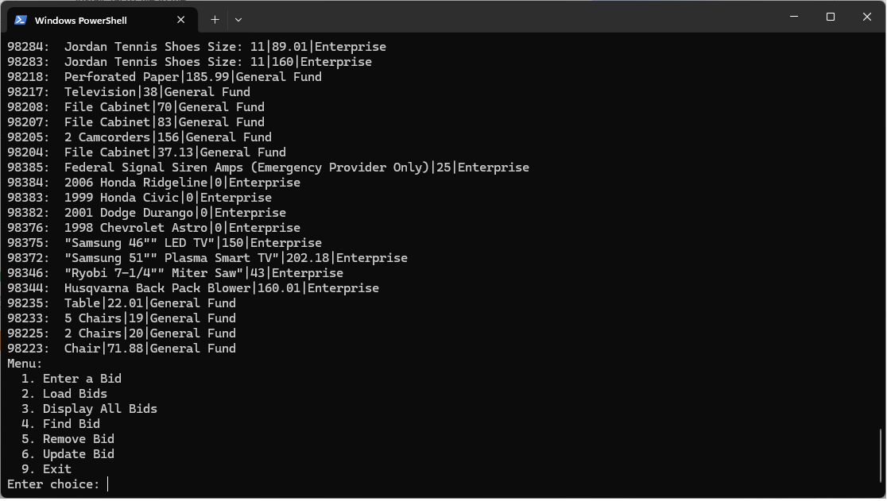

## Enhancement 1
---

<h5 style="text-align:center;">Screenshot of original LinkedList app written in C++</h5> 

<h5 style="text-align:center;">Screenshot of ported LinkedList app written in Python</h5>

Download code for enhancement one <a href="./code/LinkedList.zip">here</a>

## Narrative
---
I chose this artifact for its potential for improvement in all 3 aspects of the capstone project requirements.  Showcasing my software development ability, I decided to port the linked list project found in module three of CS-260 “Data Structures and Algorithms”.  The project was originally written in C++.  The project utilized a set of data from a csv file, parsed into a linked list structure.  I decided to rewrite this application in Python due to its reputation as the language of choice for data analysts.  The artifact improvements include rewritten into a language used widely for data analysis, as well as some bugs from the original platform such as fixing a bug causing the program to crash if a letter is chosen rather than a number, as well as the “load bids” option writing the same nodes into the link list every time the load bid option is chosen, causing duplicate entries in the list.  Unused methods were also left out including the prepend and insert functions.  Neither of the functions were accessible, and the nature of the data did not require a sorted set.

I feel I have achieved the outcome I planned to meet for the first enhancement.  The link list application has been rewritten in Python successfully.  The actions match the original implementation, including the intended linked list structure.   The outcome of the enhancement implemented for this stage of the project meets the established objectives.   Future artifact enhancements will be based on this enhancement, as my second artifact will focus on adding functionality to the Python version of this artifact.

The hardest part of this enhancement was starting the process	of porting the application over to a new language.  Much of the projects during my time at SNHU had provided a jumping off point.  There’s something to say about staring at a blank file and having to create your own battle plan.  I started by perfecting the node structure, and the method used to parse the csv file into a linked list.  This was a bit of a challenge because Python does not have a “struct” structure like C++ and Jave.  Python uses a class for a node structure instead.  Once I figured out the node structure and the csv parsing library included in Python, everything else kind of fell into place.  The main challenge as I said was starting off, however what I learned is, while I certainly can benefit from learning best practices better, I did find that once you learn to code, it’s like riding a bike.  You never really forget.

[Return to ePortfolio](../index.html)