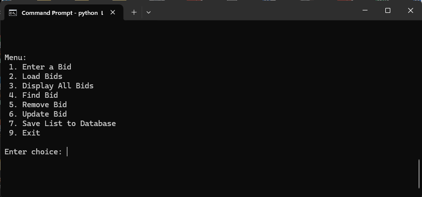

## Enhancement 2
---

<h5 style="text-align:center;">Screenshot of enhanced LinkedList app with save to database option</h5> 


<h5 style="text-align:center;">Code added to original app to create the save to database feature.</h5> 

```python
#converts nodes of linked list to dictionaries, and sends the converted data to a MongoDB
	def saveBids(self):
		convertedDocs = []
		current = self.head
	    while current:
			document = {"Bid ID" : current.bidId, "Title" : current.title, "fund" : current.fund, "amount" : current.amount}
			query = {'Bid ID' : document.get('Bid ID')}
			if not collection.find_one(query):
				convertedDocs.append(document)
				current = current.next
			else:
				current = current.next
			if convertedDocs:
			collection.insert_many(convertedDocs)
			print(f"\nSave complete. {len(convertedDocs)} added.")
		else:
			print("\nNo documents added.\n")
	#This is a hidden method to clear the database.  use to test saving data to database		
	def purgeDB(self):
		purge = collection.delete_many({})
		print("\n", purge.deleted_count, "records removed from database.\n3")
```
***Purge method included to clear database.  Purge intended for testing purposes only***

<<<<<<< Updated upstream
Download code for enhancement two <a href="./code/LinkListEnhanced.zip">here</a>
=======
Download code for enhancement two <a href="./code/LinkListEnhanced.zip"><u>here</u></a>
>>>>>>> Stashed changes

## Narrative
---
The inclusion of this artifact was mainly based on my plan to create a suitable database artifact.  In this artifact I concentrated on structures and algorithms to create missing features such as saving data and enhancing some others that were problematic from the get-go such as the algorithm m to read csv data into a linked list.  The major improvement revolves around the saving of data.  A method has been created to read through the link list, restructure the nodes into dictionaries, and store them into an array.  The array was passed to the “insert_many” method found in the Pymongo library, saving the nodes as documents on the cloud server.  This included creating a new database instance on my MongoDB account, setting up the connection to the database in the code, and creating the method to translate the nodes in the linked list from nodes to documents. 

I feel I have met the course outcomes for this enhancement, building off the new code created in enhancement one, I concentrated on the algorithm and structures of the application, identifying several tweaks, and a major improvement.  The structures and algorithms created to convert linked list nodes to non-relational database documents demonstrated my ability to find an opportunity to improve an existing solution and implement my solution.

This artifact went a little smoother than the first.  The first enhancement was square one, and there was little intimidation there.  This artifact was planned to build off the first, which made the process a little more familiar.  While in the first artifact I had an idea of how I wanted to attack the project, I was still making it up as I went along.  I had been planning this artifact since midway through the last artifact.  I had more of a plan this time around.  The major issue I had faced this time was seeing more of the code as I went along.  There were little tweaks I kept identifying, that were out of the scope of the project.  Staying on task rather than going down tangents was the biggest hurdle.


[Return to ePortfolio](../index.html)