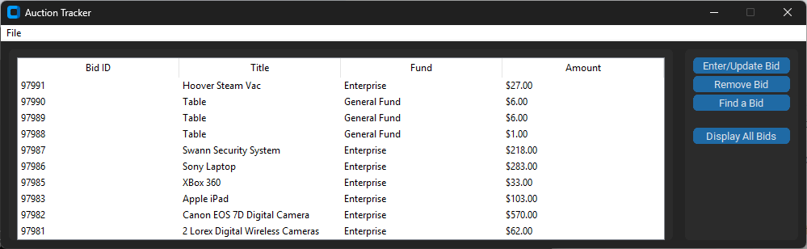
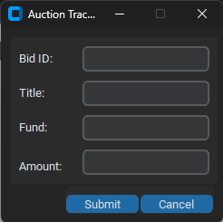
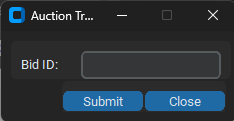

## Enhancement3
---

<h5 style="text-align:center;">Screenshot of Auction Tracker app connected to MongoDB database</h5> 

<h5 style="text-align:center;">Screenshot of input windows for AuctionTracker</h5> 
 

Download code for enhancement three <a href="./code/AuctionGUI.zip">here</a>

## Narrative
---
The inclusion of this artifact is intended to demonstrate my skill with database management.  The application can receive documents from a CSV file and populate the collection of a cloud instance of MongoDB.  The parsing of the CSV file checks to make sure no row of the CSV is duplicated before adding the data to the collection.  The application includes basic tools to add, update, remove, and retrieve documents from a non-relational database, with each function verifying data before making any changes.  This is intended to ensure data reliability. The addition of the GUI in Tkinter completes the improvement of this artifact creating a simple interface for a user than the menu driven cli based structure of the original.
    
With the third enhancement complete, the final course outcome of database skills and management has been achieved.  The enhancement has taken an application that was originally designed to manipulate data in a linked list structure held in memory, and converted to a non-relational database, providing the same features and functionality as the original but with the added benefit of persistent storage of the data, and increased security from a CSV format the original data was originally stored in.  Basic database tools for manipulating the data directly to and from the database has been developed, and a CLI interface has been upgraded to a Tkinter GUI. 
    
The third artifact was the most challenging of the three enhancements.  I decided to add a little more difficulty to the final enhancement.  The third enhancement went beyond restructuring the functionality of the original application and taking it to a new level.  Restructuring the tools from the original code designed to manipulate a list structure to database documents, was at first challenging, however, after the first method was completed, the rest fell into place.  The biggest challenge I faced with this enhancement was the size of the code.  Originally much of the code was created in a flat manner.  The code became a little hard to read, so it was decided to go in a more object-oriented manner utilizing frames to organize the GUI, and multiple pop-up windows to keep the interface as uncluttered as possible.  The change to the Object-oriented approach created a bit of a time crunch as the decision was made late in the week.  While most of the functionality is there, the finished product will run overtime constraints, however, I believe it’s the correct decision, as it will make the code easier to read in the end.

[Return to ePortfolio](../index.html)